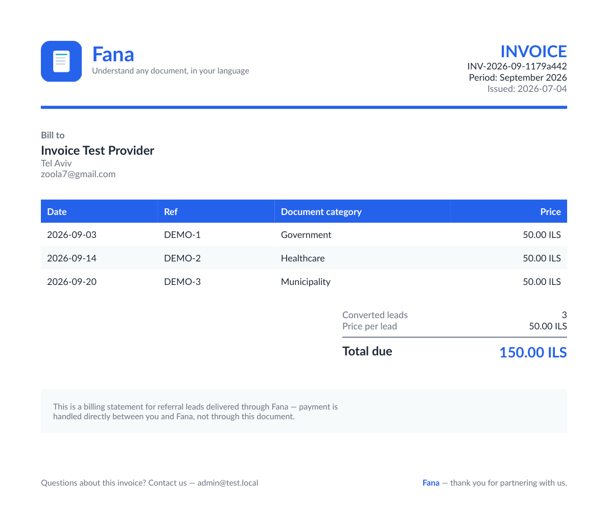

# Fana

Help Amharic-speaking residents of Israel understand official Hebrew documents
(government, bank, insurance, healthcare, municipality, employer). Upload a
document → OCR extracts the text → AI produces a structured analysis (summary,
type, urgency, key points, required actions, deadlines) **in all three languages**
→ listen to a spoken explanation → chat with the document for follow-up questions
→ get matched to vetted professionals (accountant, lawyer, insurance agent…) who
can help with that document.

> **Status:** Deployed and running. Frontend on **Netlify**, backend + **PostgreSQL**
> on **Railway**. The full pipeline runs end-to-end on real providers: **Claude**
> for OCR (vision) and analysis, **Azure Neural TTS** for spoken explanations
> (incl. native Amharic voices). Every analysis field is generated in Hebrew,
> Amharic, and English so the UI and audio stay in one chosen language. A
> sponsored-referral marketplace (vetted providers, lead lifecycle status +
> post-contact satisfaction feedback for billing integrity, partner
> self-registration, and an admin review console) is built in, alongside a
> first-run onboarding walkthrough and a one-tap "Share Fana" growth loop.
> Provider billing turns those tracked lead counts into real invoices: an admin
> can generate a persisted, immutable PDF invoice for a provider's billable
> (Converted) leads in a given month and email it to them — no payment
> collection yet, the provider still pays out-of-band. A
> B2B/B2G tenant model (`Organizations`) lets an institution — municipality,
> health fund, NGO — license Fana under its own branding for its own
> residents/members. A `?org=slug` link resolves and persists tenant branding
> client-side (logo color, welcome message, and the registration flow tags new
> members to that tenant); a global-admin console at `/admin/organizations`
> creates, edits, and activates/deactivates tenants, and shows a per-tenant
> usage dashboard (documents processed, unique members, category/urgency
> breakdowns, weekly trend). Full white-label re-theming of every screen, a
> dedicated subdomain per tenant, per-tenant data isolation, member invites,
> and a scoped org-admin role (today's dashboard is gated by the same global
> admin allowlist as everything else) are still future work (see
> **Organizations** below). A first-run, full-screen language picker
> (`LanguageGate`) blocks the rest of the app — including onboarding — until a
> visitor explicitly picks Hebrew/Amharic/English (no silent `navigator.language`
> guessing), since the app otherwise defaults to Hebrew. Once a document's pages
> are uploaded, a thumbnail strip (`DocumentPages`) lets the user reopen and
> pinch/button-zoom any page they photographed — including after a failed OCR —
> so they can verify the app read the right document. The in-app camera
> (`CameraCapture`) runs a client-side blur/exposure check (`lib/imageQuality.ts`,
> a Laplacian-variance pass) on every capture and warns (never blocks) before a
> bad photo costs the ~60s OCR+analysis round trip. The spoken walkthrough
> (`SpokenTextBuilder`) reads the summary and the detailed explanation as two
> separate labeled passages — matching the on-screen order (Summary card, then
> Explanation card directly below it) — and reads required actions with an
> audible "Required:" prefix for the ones marked mandatory. Beyond the one
> all-or-nothing walkthrough, every analysis card (Summary, Explanation, Key
> points, Actions, Deadlines) has its own small play button
> (`SectionAudioButton`) so a low-literacy user can listen to just one passage —
> e.g. "just the actions" — instead of the whole document (`TtsAudioCache` is
> keyed per document+language+section). The first-run onboarding walkthrough
> can now be replayed any time — signed in or not — from a `/help` page
> (`OnboardingProvider`/`useOnboarding`), which also has a short FAQ and a
> support-email link. Registering with an email that already has an
> unverified, never-completed signup (a typo, a lost verification email, a
> change of mind) no longer permanently blocks that address — re-registering it
> overwrites the abandoned row instead of failing forever — and the "check your
> email" / verification pages now state the link's 1-hour expiry and link back
> to `/register` for a wrong-address correction. The sponsored-referral list
> hides a provider whose blurb was never filled in for the viewer's chosen
> language, rather than silently falling back to another language's text (which
> previously could show Hebrew copy to an Amharic-language user). A required
> action's mandatory status is now also shown as a text "Required" chip, not
> just an icon/color, so it survives grayscale accessibility mode. Documents
> carry their own translated Send (WhatsApp/native share) and Print actions,
> separate from the app-level growth-loop share button, and each dated
> deadline gets a per-action checkbox (persisted locally) plus an
> "Add to calendar" `.ics` download; the dashboard leads with a "Coming up"
> strip of the nearest upcoming deadlines across all documents. A failed OCR
> now offers retry-in-place, retake-photo, or choose-a-different-file instead
> of a dead end — and the shown message distinguishes a genuinely unreadable
> page from a transient OCR-service outage (quota/rate-limit/auth), which
> otherwise looked identical to the user. Signing up right after a trial
> analysis no longer discards it: the analysis is stashed client-side and,
> once the new account is verified, a prompt offers to attach it to the
> account. A global offline banner, disabled upload/capture, and a
> distinguished dashboard empty-vs-offline state cover the no-connectivity
> case everywhere. A server-side credit ledger (`UsageLedger`) now meters every
> paid AI/TTS call — analysis, spoken audio (only on a cache miss; replaying
> already-synthesized audio stays free), and chat — for authenticated users
> and anonymous trial visitors alike, replacing a client-only `localStorage`
> counter that any user could reset and that never covered the authenticated
> analyze/chat endpoints at all. Every subject (a registered account, or an
> anonymous device id / IP for the trial flow) gets a one-time, non-renewing
> free tier (3 credits), granted lazily on first use rather than at signup; consuming a
> credit is serialized per subject with a Postgres advisory-lock transaction
> so two simultaneous requests against a subject's last credit can't both
> succeed. There's no payment rail yet — an admin grants credits manually
> (`POST /api/admin/wallet/grant`, by email or by phone number) for the first
> customers, sold out-of-band. Signed-in users see their balance and usage
> history at `/wallet`; anyone hitting the limit sees a localized prompt
> instead of a raw error code. `DocumentsController` also gained rate
> limiting (30 req/min/user) as an abuse backstop underneath the ledger — it
> previously had none at all, despite upload automatically triggering paid
> OCR in the background. Alongside this, the app now has real Terms of
> Service and Privacy Policy pages (`/terms`, `/privacy`, versioned in a
> `LegalDocuments` table, trilingual) — previously the registration page told
> users they "agree to our terms" with no such document anywhere — and every
> uploaded document carries a `RetainUntil` date (24 months from upload by
> default), swept and deleted by a background `RetentionSweepWorker` once it
> passes. On top of the ledger, a sponsorship flow (`/gift`) answers the
> product insight that the user and the payer are often different people: a
> signed-in account can gift credits — debited from their own balance
> immediately, never manufactured — to anyone via a one-time link
> (`/redeem/{token}`), with no account required on the recipient's end until
> they actually redeem it. The redeem token is hashed with plain SHA-256 (not
> the PBKDF2 `IPasswordHasher` used for account passwords), since a 256-bit
> random token can be looked up directly by its hash without needing a second
> identifier the way a password reset link does. Redemption is race-safe via
> a conditional `UPDATE ... WHERE RedeemedByUserId IS NULL` rather than a
> lock, so two simultaneous attempts on the same link can't both succeed. If
> the person opening the link isn't signed in yet — the common case, since a
> gift is often someone's first-ever contact with Fana — the token is stashed
> client-side and redeemed automatically the moment they finish registering
> or logging in, wherever they land afterward.



## Tech stack

| Layer     | Tech                                                                 |
|-----------|----------------------------------------------------------------------|
| Backend   | ASP.NET Core 9 Web API · Clean Architecture · CQRS (MediatR) · Repository pattern · Dapper |
| Database  | PostgreSQL (via Npgsql); Railway-managed in production, Docker locally |
| Auth      | JWT access + refresh tokens, PBKDF2 password hashing; admins by `Admin:Emails` allowlist; forgot/reset-password flow emails a single-use, 1-hour link (`/forgot-password` → `/reset-password`) via the same `IEmailSender` built for invoicing; registration requires email verification before login — a new account starts unverified, gets emailed a single-use, 1-hour link (`/verify-email`), and only receives JWTs once that link is clicked (`/check-email` interstitial + a resend-verification option, both server- and login-page-side); re-registering an email whose only prior signup was never verified overwrites that abandoned row instead of blocking the address forever, so a typo or a lost verification email is recoverable; account lockout after repeated failed logins (`Auth:MaxFailedLoginAttempts`/`Auth:LockoutMinutes`, on top of the per-IP rate limiter); "remember me" on login chooses `localStorage` (persists across browser restarts) vs. `sessionStorage` (cleared when the tab closes) for the token pair |
| Referrals | Vetted providers matched per document category · per-lead tracking with lifecycle status (New/Contacted/Responded/Converted/Invalid) for billing integrity · anonymous post-contact "was this helpful?" feedback → per-provider satisfaction rate · anonymous partner self-registration · admin approve/manage console |
| Invoicing | Admin-initiated, persisted PDF invoices (QuestPDF), branded with the Fana logo/colors, per provider + calendar month, snapshotting billable (Converted) leads so a later status change never rewrites history · emailed via SMTP (MailKit) · one invoice per provider/month (unique index) · generation always persists even if the email send fails (`Status=Failed` + `SendError`, PDF still downloadable) · a billing statement, not a payment-collection/tax document — no tax ID or bank details, since payment is handled directly, out-of-band |
| Organizations | B2B/B2G tenants (`Organizations`) — a user optionally tags itself to a tenant by slug at registration; admin-only tenant create/edit/activate-deactivate and an aggregate, anonymized usage dashboard (documents processed, unique members, category/urgency/weekly breakdowns) per tenant. Slug is locked after creation |
| AI        | `IAiProvider` → `ClaudeAiProvider` (default) / `OpenAiProvider` · prompt-cached system prompt + tool schema (`cache_control`, ~90% input-cost cut on repeats within the cache TTL) · per-call token usage and `stop_reason`-truncation logged (`AnthropicResponseHelpers`) · transport-failure + `Retry-After`-aware retry with an explicit 60s `HttpClient.Timeout` (`AnthropicHttp`) |
| OCR       | `IOcrProvider` → `ClaudeOcrProvider` (default, on a separate cheaper `Ai:AnthropicOcrModel` tier) / Google Vision / Azure · runs off the request thread — see Document processing below |
| Document processing | Upload persists every page and returns `202 Accepted` immediately; OCR then runs page-by-page in `DocumentProcessor`, driven by an in-memory queue + `DocumentProcessingWorker` background service (with startup reconciliation for anything left mid-job by a crash/redeploy). The client polls `GET /documents/{id}` (`Status`/`ProcessedPages`/`TotalPages`) instead of holding one long-lived request open |
| Analytics | Minimal funnel instrumentation (`AnalyticsEvents`) — registered/verified/uploaded/analyzed counts, viewable via `GET /api/admin/analytics/funnel` (admin only) and on the `/admin/analytics` dashboard page (period selector: 7/30/90 days); each stage is clickable and drills into the individual events (`GET /api/admin/analytics/funnel/{eventName}`) — who (email, or "deleted account" if the user's since been removed) and when. Tracking failures never fail the request they're attached to |
| TTS       | `ITtsProvider` → `AzureTtsProvider` (default) / ElevenLabs · full-walkthrough or single-section (`SpokenSection`: Summary/Explanation/KeyPoints/Actions/Deadlines) audio, cached per (document, language, section) |
| Frontend  | Next.js 15 · TypeScript · Tailwind CSS · shadcn-style UI             |
| Languages | Hebrew (default until chosen, RTL) · Amharic · English · a blocking first-run `LanguageGate` asks explicitly rather than guessing from `navigator.language` |
| Hosting   | Netlify (frontend) · Railway (API + PostgreSQL, + a Volume for uploaded files — see `DEPLOY.md`) |
| Hardening | Per-endpoint rate limiting (auth/trial/referrals/**documents**) · CORS policy · PWA service worker · accessibility widget |
| Performance | Brotli/gzip response compression · output caching on the tenant-branding endpoint · indexed hot query paths (`Users.OrganizationId`, `DocumentAnalyses.CreatedAt`) · immutable-cached static assets and tree-shaken icon imports on the frontend |
| Health    | `/health` runs a real Postgres connectivity check (`DatabaseHealthCheck`), not a static literal — returns 503 when the database is unreachable |
| Wallet    | `IWalletService` → `WalletService` — an append-only `UsageLedger` (balance is always `SUM(Delta)`, never a mutable column) meters analyze/speech(on a cache miss)/chat for both authenticated users and anonymous trial visitors; `TryConsumeAsync` is serialized per subject via a Postgres advisory-lock transaction (`pg_advisory_xact_lock`) so two concurrent requests against a subject's last credit can't both succeed; a one-time, non-renewing free tier (3 credits) is granted lazily on first spend; admin-only manual grants (`POST /api/admin/wallet/grant`, by email or phone — no payment rail yet) |
| Sponsorship | Gift credits to someone else (`/gift`) — `TryDebitForSponsorshipAsync` deducts from the sponsor's own balance at creation time (same advisory-lock pattern as `TryConsumeAsync`, but never triggers the free-tier grant), a one-time link is returned (raw token shown once, only its SHA-256 hash persisted), and redemption (`POST /api/wallet/redeem/{token}`) is race-safe via a conditional `UPDATE ... WHERE RedeemedByUserId IS NULL`. A visitor who isn't signed in yet has the token stashed client-side and redeemed automatically once they finish registering/logging in |
| Legal     | Versioned Terms/Privacy documents (`LegalDocuments`, trilingual) served at `/terms` and `/privacy`; `ConsentRecords` for acceptance evidence; every `Document` carries a `RetainUntil` (24 months from upload by default), swept by a background `RetentionSweepWorker` |

> **QuestPDF licensing note:** invoice PDFs are generated with QuestPDF's free
> "Community" license, which applies only below a revenue threshold QuestPDF
> sets (check their license page before this matters commercially). Above that
> threshold, a paid QuestPDF license is required.

## Project structure

```
Fana 2.0/
├─ docker-compose.yml          # postgres + api + frontend
├─ DEPLOY.md                   # Netlify + Railway deployment guide
├─ backend/
│  ├─ AmharicHelper.sln
│  ├─ Dockerfile
│  └─ src/
│     ├─ AmharicHelper.Domain/         # entities, enums, value objects (incl. LocalizedText)
│     ├─ AmharicHelper.Application/     # CQRS, DTOs, abstractions, prompt templates, TTS text builder
│     ├─ AmharicHelper.Infrastructure/  # Dapper repos, migrations, providers, JWT
│     └─ AmharicHelper.Api/             # controllers, Program.cs, DI, Swagger
│  └─ tests/AmharicHelper.UnitTests/
└─ frontend/
   ├─ app/                      # landing, login, register, check-email, verify-email,
   │                           #   forgot-password, reset-password, help (FAQ + replay onboarding),
   │                           #   dashboard, upload, documents/[id], documents/[id]/chat, profile,
   │                           #   wallet (credit balance + usage history), gift (send credits),
   │                           #   redeem/[token] (claim a gift link), terms, privacy,
   │                           #   partners (self-registration), admin/providers,
   │                           #   admin/organizations (B2G tenant console),
   │                           #   admin/analytics (funnel dashboard)
   ├─ components/               # Navbar, UploadExperience, CameraCapture, AnalysisCard,
   │                           #   DocumentPages (page thumbnails + zoom lightbox),
   │                           #   ReferralBlock, LeadFeedbackPrompt, ShareButton, Onboarding,
   │                           #   SectionAudioButton (per-card "read just this" playback),
   │                           #   OutOfCreditsPrompt (shown wherever a metered call is refused),
   │                           #   RedeemPendingPrompt (finishes a gift redemption stashed
   │                           #   pre-auth, wherever the user lands after signing in),
   │                           #   LanguageGate, AccessibilityWidget, ServiceWorker, ui/
   ├─ lib/                      # api client, auth + language + organization + onboarding contexts,
   │                           #   types, support (support-contact constant), deviceId (anonymous
   │                           #   trial metering — replaced the old client-only trial.ts counter),
   │                           #   pendingRedeemToken (stash a gift token across the auth detour),
   │                           #   imageQuality (client-side blur/exposure check)
   ├─ i18n/                     # he / am / en dictionaries
   └─ jest.config.js, jest.setup.ts  # Jest + React Testing Library; *.test.ts(x) live in
                                      #   __tests__/ folders next to the code they cover
```

The backend Application layer is organized by feature (`Auth`, `Documents`,
`Chat`, `Trial`, `Partners`, `Referrals`, `Organizations`, `Legal`, `Wallet`),
each with its CQRS commands/queries.

### Database schema
`Users` (with an optional `OrganizationId`), `RefreshTokens`, `Documents` (with
`Status`/`ProcessedPages`/`TotalPages`/`SkippedPages`/`ProcessingError` for the
background OCR pipeline, `PageContentTypes` alongside `PagePaths`, and a
`RetainUntil` retention date swept by `RetentionSweepWorker`),
`DocumentAnalyses`, `ChatMessages`, `TtsAudioCache` (keyed per document,
language, and `Section` — the whole walkthrough or one passage), `Providers`,
`Leads` (with `Status` and `Helpful` columns for lead lifecycle + post-contact
feedback), `Organizations` (B2B/B2G tenant branding), `Invoices` (persisted,
immutable per-provider/month billing snapshots, unique on `(ProviderId,
PeriodYear, PeriodMonth)`), `AnalyticsEvents` (minimal funnel instrumentation —
event name + optional user + timestamp), `LegalDocuments` (versioned
Terms/Privacy bodies, trilingual), `ConsentRecords` (acceptance evidence, by
`UserId` or a hashed `ContactHash`), `UsageLedger` (append-only credit
movements — see Wallet above; balance is always `SUM(Delta)`, never a mutable
column), `Sponsorships` (gift credits — see Sponsorship above; `RedeemTokenHash`
is a plain SHA-256, deliberately not the PBKDF2 `IPasswordHasher` used for
account passwords) (see
`backend/src/AmharicHelper.Infrastructure/Migrations/`, numbered `001`–`023`).
Migrations are idempotent PostgreSQL and run on API startup. Analysis text
columns store JSON localized to `{ he, am, en }`.

### API endpoints
- `POST /api/auth/register | login | refresh | forgot-password | reset-password | verify-email | resend-verification`
- `GET  /api/users/me`, `GET /api/users/me/export` (GDPR Art. 15 data export — profile + every document/analysis/chat as JSON), `DELETE /api/users/me` (GDPR Art. 17 account erasure — irreversible)
- `POST /api/documents` (upload — returns `202 Accepted` immediately; OCR runs in the background, see Document processing above), `GET /api/documents` (list, with each document's processing `Status` and upcoming `Deadlines`), `GET /api/documents/{id}` (poll for `Status`/`ProcessedPages`/`TotalPages`/`SkippedPages`/`ProcessingError` and, once ready, the analysis)
- `POST /api/documents/{id}/analyze?category=` — metered: fails with `OUT_OF_CREDITS` if the caller's `UsageLedger` balance can't cover it (see Wallet above)
- `POST /api/documents/{id}/retry-ocr` (re-queue a `Failed` document for another OCR pass)
- `POST /api/documents/attach-trial` (persist an anonymous trial analysis to the now-signed-in account)
- `GET  /api/documents/{id}/pages/{index}` (raw file for one uploaded page — image or PDF — so the user can review what they photographed; client-cached, immutable once uploaded)
- `GET  /api/documents/{id}/speech?language=&section=` (spoken audio, MP3 — `section` defaults to the full walkthrough; pass `Summary`/`Explanation`/`KeyPoints`/`Actions`/`Deadlines` for one card's passage; metered only on a `TtsAudioCache` miss — replaying already-synthesized audio is free)
- `GET|POST /api/documents/{id}/chat` — `POST` is metered (every chat turn is a fresh AI call, no cache)
- `POST /api/trial/analyze`, `POST /api/trial/speech` (anonymous trial, nothing saved — still synchronous, capped at 5 pages; `speech` accepts the same optional `section`; metered against a subject built from the `X-Device-Id` header, or a per-IP fallback if absent)
- `GET  /api/wallet` (my credit balance + recent usage history — authenticated)
- `POST /api/wallet/sponsor` (gift credits to someone else — debits the caller's own balance immediately, returns a one-time redeem link)
- `POST /api/wallet/redeem/{token}` (redeem a gift link, crediting the caller's own account — race-safe via a conditional UPDATE)
- `GET  /api/wallet/sponsorships` (my own gift history — sent links and whether each has been redeemed)
- `POST /api/admin/wallet/grant` (manually grant credits by email or phone — admin only, no payment rail yet)
- `GET  /api/legal/{kind}?language=` (Terms/Privacy document body in one language — anonymous, `kind` is `terms` or `privacy`)
- `GET  /api/referrals?category=` (matched providers), `POST /api/referrals/{providerId}/lead` (log a contact) — anonymous, rate-limited
- `POST /api/referrals/feedback/{refCode}` (post-contact "did this help?" signal) — anonymous, rate-limited
- `POST /api/partners/apply` (business self-registration, anonymous, rate-limited)
- `GET|PUT|POST|DELETE /api/admin/providers...` (review/manage providers — admin only)
- `GET  /api/admin/leads` (lead overview — admin only), `PUT /api/admin/leads/{id}/status` (update lead lifecycle status — admin only)
- `GET /api/admin/providers/{id}/invoices/status?year=&month=` (check if an invoice exists for a provider+month), `POST /api/admin/providers/{id}/invoices/generate` (generate + email a PDF invoice for the billable leads in that month), `GET /api/admin/providers/{id}/invoices/{invoiceId}/pdf` (re-download the PDF) — admin only
- `GET  /api/organizations/{slug}` (tenant branding lookup — anonymous, drives a white-labeled front end, output-cached 2 min)
- `POST /api/admin/organizations` (create a tenant), `GET /api/admin/organizations` (list), `PUT /api/admin/organizations/{id}` (edit branding — slug immutable), `POST /api/admin/organizations/{id}/active?value=` (activate/deactivate), `GET /api/admin/organizations/{id}/stats` (usage dashboard) — admin only
- `GET /api/admin/analytics/funnel?days=` (event counts over a trailing window — admin only), `GET /api/admin/analytics/funnel/{eventName}?days=` (drill down: the individual occurrences behind one count — admin only)
- `GET /health` (real Postgres connectivity check)

## Local development

### Option A — everything in Docker (recommended)
```bash
cd "Fana 2.0"
export ANTHROPIC_API_KEY=sk-ant-...     # required for real OCR + analysis
export SENDGRID_API_KEY=SG....          # required for real invoice/password-reset emails
export SENDGRID_FROM_EMAIL=you@yourdomain.com  # must be verified in SendGrid (Settings -> Sender Authentication)
docker compose up --build
```
- API: http://localhost:5080 (Swagger at `/swagger`)
- Frontend: http://localhost:3001
- PostgreSQL: `localhost:5432` (`fana` / `fana_local_pass`, db `AmharicHelper`)

Migrations and seed scripts run automatically on API startup (idempotent). The
API waits for the database to accept connections before migrating, so it won't
crash if Postgres is still booting.

### Option B — run pieces locally
```bash
# 1. Database only
docker compose up postgres

# 2. Backend
cd backend
dotnet run --project src/AmharicHelper.Api      # http://localhost:5080

# 3. Frontend
cd frontend
cp .env.example .env.local
npm install
npm run dev                                     # http://localhost:3000
```

Create an account on the **Register** page to start (the seeded demo row is a
placeholder; register a real user for a working login).

### Tests
```bash
cd backend && dotnet test          # xUnit — hand-written fakes, no mocking library
cd frontend && npm test            # Jest + React Testing Library
```

## Configuration

Backend config lives in `appsettings.json` and can be overridden by environment
variables (double-underscore syntax, e.g. `Ai__Provider`):

| Key                       | Purpose                                            | Default       |
|---------------------------|----------------------------------------------------|---------------|
| `ConnectionStrings__Default` | PostgreSQL connection (Npgsql kv string, or a `postgres://` URL such as Railway's `DATABASE_URL`) | local Postgres |
| `Jwt__Secret`             | JWT signing key (≥32 chars)                        | placeholder   |
| `Ai__Provider`            | `Claude` or `OpenAI`                               | `Claude`      |
| `Ai__AnthropicApiKey` / `ANTHROPIC_API_KEY` | Claude API key (used for AI + OCR) | empty         |
| `Ai__AnthropicOcrModel`   | Model used for OCR — a cheaper tier than `Ai__AnthropicModel` since OCR is high-volume transcription, not analysis-grade reasoning | `claude-haiku-4-5-20251001` |
| `Ocr__Provider`           | `Claude`, `Mock`, `Google`, or `Azure`             | `Claude`      |
| `Storage__RootPath`       | Where uploaded page files are written — point this at a mounted volume in production (see `DEPLOY.md`) or every redeploy loses uploaded files | `<app>/uploads` |
| `Tts__Provider`           | `Azure` or `ElevenLabs`                            | `Azure`       |
| `Tts__AzureSpeechKey` / `Tts__AzureRegion` | Azure Speech credentials          | empty         |
| `Admin__Emails`           | CSV of emails granted admin access (provider/lead consoles) | empty |
| `Auth__MaxFailedLoginAttempts` | Consecutive wrong-password attempts before an account is temporarily locked | `5` |
| `Auth__LockoutMinutes`    | How long an account stays locked after hitting the attempt limit | `15` |
| `Email__Provider` | `SendGridApi` (default, HTTPS — works on hosts like Railway that block outbound SMTP ports) or `Smtp` (MailKit, for hosts that don't) | `SendGridApi` |
| `Email__Smtp__Password` / `From` | SendGrid API key / verified sender, used to email generated invoice PDFs and password-reset links; via `SENDGRID_API_KEY` / `SENDGRID_FROM_EMAIL` in Docker. `Host`/`Port`/`Username` only matter for the `Smtp` provider | empty |
| `Company__SupportEmail`   | "Questions about this invoice?" contact shown on invoice PDFs; falls back to the first `Admin:Emails` entry if unset | empty |

> **Frontend support contact:** `frontend/lib/support.ts` exports `SUPPORT_EMAIL`,
> shown as a mailto link on the `/help` page. It's a placeholder — replace it
> with the real support address before shipping the Help page to production.

## Deployment

Production runs on **Netlify** (frontend) + **Railway** (API + managed PostgreSQL).
Full step-by-step instructions, environment variables, and service settings are in
[`DEPLOY.md`](DEPLOY.md). Key points:

- The API reads `ConnectionStrings__Default`; on Railway set it to the Postgres
  service's `DATABASE_URL` (`${{Postgres.DATABASE_URL}}`). The app converts the URL
  to an Npgsql connection string automatically.
- Idempotent migrations create the schema on startup — no manual DB setup.
- Secrets (`Jwt__Secret`, `ANTHROPIC_API_KEY`, Azure Speech key) live in the host's
  variable store, never in the repo. `LocalFileStorage` keeps uploads on disk; swap
  it behind `IFileStorage` for blob storage if you need uploads to outlive the container.

## Future features (not implemented)
Native mobile app · government-forms assistant · appointment booking. (The
professional-referral marketplace, originally a future item, is now built — see
**Referrals** above. Contact links include WhatsApp deep-links.)
